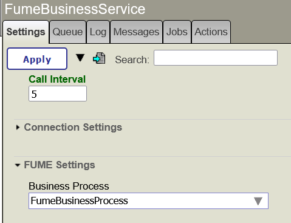
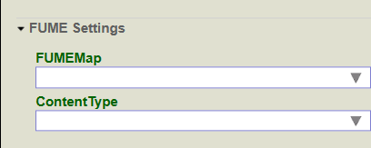
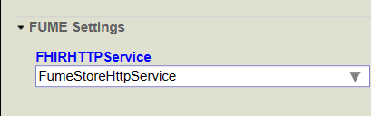
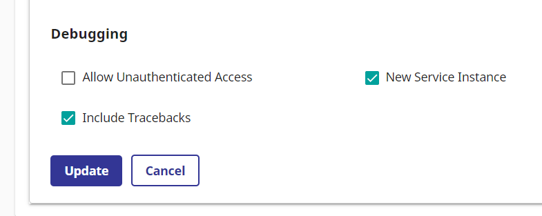
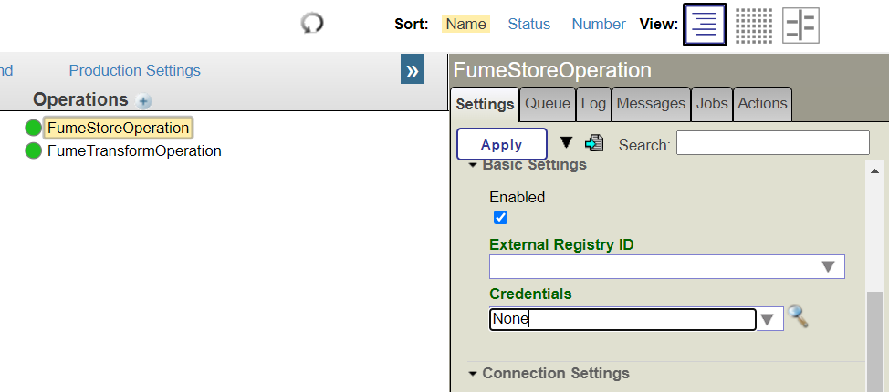
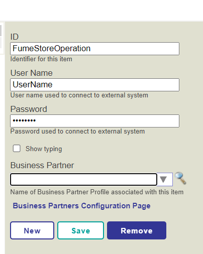
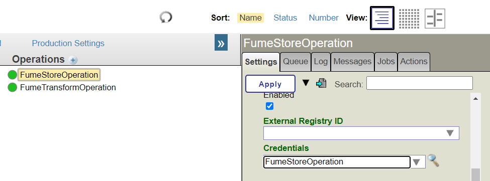

## Configuring InterSystems IRIS and HealthShare Health Connect FUME plugin

- [Configuring FUME plugin](#configuring-iris-fume-plugin)
  - [Production settings](#production-settings)
  - [FumeBusinessService component](#fumebusinessservice-component)
  - [FUME plugin REST service](#fume-plugin-rest-service)
  - [FumeTransformOperation component](#fumetransformoperation-component)
  - [FumeStoreOperation component](#fumestoreoperation-component)
  - [Development and customization of Production business processes using FUME Plugin components](#development-and-customization-of-production-business-processes-using-FUME-plugin-components)
  - [Applying FUME mappings to incoming data streams](#applying-fume-mappings-to-incoming-data-streams)
- [Configuring local IRIS FHIR server security](#configuring-local-iris-fhir-server-security)


### Production settings

The production contains the following properties:

|Property | Description |
|---------|-------------|
| FUMEEndpoint|Specifies the URL of the FUME server. If you used the FUME plugin installer to set up the package, that property's value should already be set.
| FUMEDesignerUrl|Specifies the URL of the FUME designer (valid for FUME enterprise versions only)|


To change the production value, do the following:
* Open your production
* Click the `Production settings` link
* Find and modify the property value as follows:

* Click the `Apply` button to save changes

Other essential production components are `FumeBusinessService`, `FumeTransformOperation` and `FumeStoreOperation`, which are included in the FUME plugin distribution. 

### FumeBusinessService component

This component is responsible for receiving and processing incoming data in HL7v2, CSV, and JSON formats. 

The component works as an HTTP service and can receive multiple requests simultaneously.  

The component handles HTTP requests in which the Content-Type header contains one of the following values:

* `x-application/hl7-v2+er7` - for processing messages in HL7v2 format
* `application/json`, `text/json` - for processing messages in JSON format
* `text/csv` - for processing messages in CSV format

If none of these values are provided, or if the value of `text/plain` is passed in the `Content-Type` HTTP header, the component will attempt to determine the actual data type of the incoming stream on its own.

By default, text data is expected to be transmitted in UTF-8 encoding, but one may specify a different encoding using the HTTP Content-Type header. 

**Example:**

```text
Content-Type: text/csv;charset=windows-1252  
```
**FUME Settings**  

The component exposes the following main properties:

|Property | Description |
|---------|-------------|
|BusinessProcess|**FUME Plugin** comes with a basic business process implementation (see the `FumeBusinessProcess` component). If you have developed your custom Business processes, you can specify which one should process data streams that come from the `FumeBusinessService` component – see Business Process settings on the "FUME Settings" tab|



If the client passes a stream with an unknown or unsupported data type, the incoming message will be rejected, and an error message will be written to the IRIS system event log.

If the message is successfully accepted, it will be written to the Production message log and then the message will be passed to the next Production component for processing. 

In addition, the component exposes the following properties:

|Property | Description |
|---------|-------------|
|Charset|Specifies the character encoding of incoming text streams. The default value is `UTF-8`. Normally, this setting value should never be changed.|

The `FumeHL7Request`, `FumeCSVRequest`, and `FumeJSONRequest` message classes are used to transfer messages in HL7v2, CSV and JSON formats within Production boundaries.


### FUME plugin REST service

The FUME plugin defines a new Web Application that exposes the following REST endpoints:

- /csp/healthshare/{namespace}/fume/rest/json/{fumeMap?}
- /csp/healthshare/{namespace}/fume/rest/csv/{fumeMap?}
- /csp/healthshare/{namespace}/fume/rest/hl7/{fumeMap?}

* The {namespace} variable corresponds to your current namespace in IRIS for Health (e.g. "clinic1" etc)
* The {fumeMap} variable specifies the FUME mapping identifier, which should be used to transform data. *This is an optional parameter. If used, all other FUME Conversion map-related settings will be ignored* (Please refer to [Applying FUME mapping to incoming data streams](#applying-fume-mappings-to-incoming-data-streams) section for extended information about FUME mapping assignment rules)

**Important Note:**  
By default, REST is secured by Basic Authentication. Please use your IRIS credential with appropriate permissions to access exposed REST services. 

These endpoints accept incoming data in JSON, CSV, and HL7v2 format, respectively, and then forward the data stream to the FUME server. 

### FumeTransformOperation component

This component is responsible for the direct transformation of messages of types `FumeHL7Request`, `FumeCSVRequest,` and `FumeJSONRequest` into HL7 FHIR resources using the FUME conversion engine. 

The component uses the **FUMEEnpoint** setting available within the *Production Settings* to establish FUME REST Calls using predefined syntax supported by the FUME engine. If you'd like to change the FUME service URL endpoint, please follow the instructions included in the chapter Production Component. If the Production contains multiple instances of the component, all of them will share the same FUME server as a healthcare data transformation service.

The solution comes with the pre-registered instance of FumeTransformOperation, capable of calling the FUME engine in the context of one conversion map only.  

The single instance of the FumeTransformOperation exposes the following main settings:

|Property | Description |
|---------|-------------|
| FUMEMap | Here you will specify the code of the FUME conversion map, which should be used to transform your data, via FUME, into the FHIR resource. If this field is left blank, the incoming message will be passed to the internal FUME HL7v2 router [see IRIS FUME HL7v2 plugin page](/fume-tester.md), which will try to pick a transformation rule for the incoming message. Note that the conversion FUME mapping defining the conversion rule for the incoming message can also be defined in the Business Process Editor or passed over to the FUME plugin REST service. In both cases, the FUMEMap setting within the FumeTransformOperation should remain blank|
|ContentType| Specifies the data format of incoming streams. This is an optional parameter and should remain empty when the source message is populated using the REST interface| 

Please refer to [Applying FUME mapping to incoming data streams](#applying-fume-mappings-to-incoming-data-streams) section for extended information about FUME mapping assignment rules




In addition, the component exposes the following properties:

|Property | Description |
|---------|-------------|
| SSLConfig | Specifies which SSL configuration should be used to call the FUME server | 
| SSLCheckServerIdentity | In debugging mode, if your FUME service instance is protected by a self-signed SSL certificate, This option should be disabled|

You may add any number of `FumeTransformOperation` class components. It is handy if you plan to use multiple FUME transformations using different mappings and content types.

When the transformation of the incoming message into HL7 FHIR format is completed, the `FumeTransformOperation` component registers a new message of type `FumeTransformResponse` in the IRIS Messages journal.

If the transformation process is completed with an error, the component writes an error message to the IRIS event log.

### FumeStoreOperation component

This component is responsible for submitting a message of type `FumeStoreRequest` to the endpoint of the FHIR server (Internal FHIR Repository or External FHIR Server). Messages of this type contain a nested resource in FHIR format. 

The FumeStoreOperation component uses different approaches when submitting FHIR data to the FHIR server. If the FHIR resource contains a valid logical id (Resource.id), it will be saved using HTTP PUT method; otherwise, it will be submitted using HTTP POST. This will allow you to keep so-called FHIR client-assigned IDs. The default method applied on Transaction or Batch Bundles is POST. 

If the REST operation applied on the FHIR resource is completed successfully, the component logs a response message of type `FumeStoreResponse` in the IRIS Messages log and returns the message to the client in JSON format. 

The `FumeStoreResponse` message has a `Location` property that contains the URL of the saved FHIR resource. In some cases, this field can be empty - for example, if the resource is submitted to the FHIR server as a transactional or batch Bundle.

In case of an error, the component writes an error message to the IRIS Messages log.

In addition, the full flow of data with the FUME server is also written in the IRIS Messages trace.

To add a new instance, add a new Business Operation of type  `Outburn.Fume.NativeProduction.BusinessOperation.FumeStoreOperation` and give it a new name (e.g. FumeStoreOperationNEW)

The component exposes the following main properties:

|Property | Description |
|---------|-------------|
| FHIRHTTPService| The identifier of the External HTTP service which should be registered in the *Service Registry* (under Health->Service Registry) to communicate with a FHIR server|



The component exposes the following additional properties:

|Property | Description |
|---------|-------------|
| SSLConfig |  The name of an existing SSL/TLS system configuration set to use for communication with a FHIR server |
| SSLCheckServerIdentity | In debugging mode, if your FHIR server instance is protected by a self-signed SSL certificate, This option should be disabled|


### Development and customization of Production business processes using FUME plugin components

To develop the simplest process for converting your data from HL7v2, CSV, and JSON formats into FHIR, the three components described above are sufficient. However, you can make your own changes to the proposed architecture and replace some components with others or add additional business components (e.g. Routers or Additional Business Operations). Let's look at the `Business Process` component, which provides coordination of data flows, as shown in the image below:
 


A `FumeBusinessService` component receives an incoming data stream and then routes data to a `Business Process` component. 

A `Business Process` component invokes a FUME transformation using a `FumeTransformOperation` component, which performs data transformations, then invokes another `FumeStoreOperation` component, which submits a FHIR resource instance to the FHIR server. 

The `Business Process Designer` provides the ability to fine-tune the rules of data transformation and routing. Here you can use not only FUME components but any other components and transformers that come with the IRIS standard library. 

For example, in the `Business Process BPL` you can specify which FUME mapping should be used for a specific data transformation using FUME:


Please refer to [Applying FUME mapping to incoming data streams](#applying-fume-mappings-to-incoming-data-streams) section for extended information about FUME mapping assignment rules

If errors occur in the process of converting HL7v2 format messages to FHIR format, they can be passed to another standard component that is responsible for receiving and storing erroneous HL7 ACK messages in the file system.

The default installation package is supplied with the simple Business Process, named FumeBusinessProcess. It is capable of calling a single FumeTransformOperation, getting the transformation result (FHIR resource) back, and calling FumeStoreOperation.

### Applying FUME mappings to incoming data streams

Each FUME mapping transformation stored on the FUME server has a unique identifier. This crucial parameter allows the FUME plugin business logic to apply a specific transformation rule to each incoming data stream. 

While configuring an IRIS entire business process, the code of the specific FUME mapping can be set statically or dynamically.

If such an identifier is specified statically, all incoming data streams will be transformed using a single and immutable FUME rule.

In other scenarios, the client can pass the code of the required FUME mapping externally, or the business process can be configured so that the code of the required FUME mapping will be calculated during the execution of the business process.

The following table lists all the options available when mapping a FUME transformation rule to your input data stream:

|Method|Type|Notes|Map settings|
|---------|-------------|-----|-----|
|Pass FUME mapping code via HTTP REST request|Dynamic| Allows a client to apply a certain FUME mapping to an input data stream. Example: `POST http://iris.server/csp/healthshare/your-namespace/fume/rest/json/SomeFumeMap`|FumeBusinessProcess and FumeTrasnformOperation settings will be ignored| 
|Business process configuration| Static/Dynamic|Use the IRIS business process visual designer. A business process that coordinates FUME plugin components interaction (`FumeBusinessService` and `FumeTransformOperation`). It can evaluate the code of a FUME mapping which should be applied to your data stream, and then pass that code to the `FumeTransformOperation` component (the latter is responsible for communication with FUME server)|FumeTransformOperation.FUMEmap should remain empty|
|Modify the `FumeTransformOperation.FUMEMap` property |Static|Select the `FumeTransformOperation` component in the Iris Production editor, then find the `FUMEMap` property, select the desired FUME transformation rule from the drop-down list, and, finally, save component settings. The selected rule will then be applied to all input data streams|FUME mapping assignment within the Business Process configuration should remain empty|
|Use FUME HL7v2 rotuer|Dynamic|FUME mapping assignment is managed by FUME HL7v2 plugin.[Please refer to IRIS FUME HL7v2 plugin page](fume-tester.md)|FumeTransformOperation and Business Process FUME mapping settings should remain empty|

Following is the list of  transformation scenarios in which the FUME mapping identifier can be specified statically or dynamically:

1) JSON or CSV source messages
  - If you do not make any changes to the `FumeBusimessProcess` configuration, and if you have exactly one `FumeTransformOperation` component registered in your Production, and if that component does not have the `FUMEMap` property populated, you can pass the identifier of the required FUME mapping via a REST service. In this case, the identifier of the FUME mapping is passed to the business process dynamically.
  - If you want to register multiple components of type `FumeTransformOperation` (each must have the `FUMEMap` property value set), you'll need to modify the business process and configure the redirection of data flows to the required `FumeTransformOperation` component using the business process editor

2)  HL7v2 source message
  - By default, the built-in FUME HL7v2 plugin's FUME HL7v2 router works. The HL7v2 router determines which FUME mapping should be used to transform a HL7 message of a certain type.
  - If you pass the FUME mapping externally via a REST service, the HL7v2 message will be converted using that FUME mapping. In this scenario, the HL7v2 router will be disabled.


## Configuring local IRIS FHIR server security

If the plugin has been installed using the ZPM installer, and if a FHIR endpoint has been created by the installer, please note that the newly created FHIR endpoint is not protected by HTTP security and allows unauthenticated users to access the endpoint.

To secure the FHIR endpoint, do the following:
* In the IRIS portal main menu, click the `Home` > `Health` menu item
*  On the `Management portal` page, select the namespace to which your FHIR endpoint belongs (e.g. `FUME`)
*  On the next page, click on `FHIR configuration` and then click the `Go` button
*  On the `Intersystems FHIR` configuration page, click `Server configuration`
*  On the `Server Configuration` page, select the endpoint you want to protect (e.g. /csp/healthshare/fume/fhir/r4) and expand the form
*  Scroll down the page and click `Edit` button
*  Uncheck the `Allow Unauthenticated Access` checkbox, then click `Update`



Next, FumeStoreOperation component properties should be adjusted to allow the component to communicate with the FHIR endpoint, as follows:

* Navigate to FUME production page
* Select the `FumeStoreOperation` component
* Click the `Settings` tab
* Scroll down and locate the `Credentials` dropdown list:

* Click the `Details` button. The `Credentials Viewer` page will be opened
* Register a new username/password pair for HTTP basic authentication. Both will be used to access IRIS FHIR endpoint:
  
* Save the record and return back to the Production page.
* Assign the newly created `Credentials` entry to the `FumeStoreOperation` component:



* Click the `Apply` button


