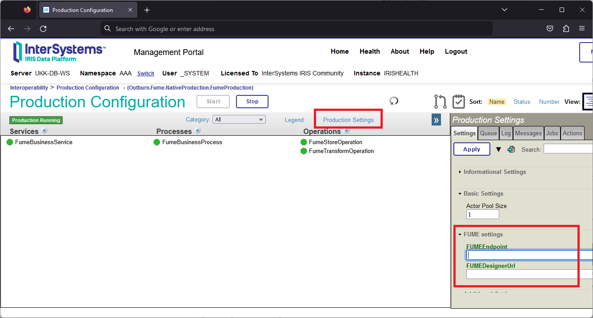
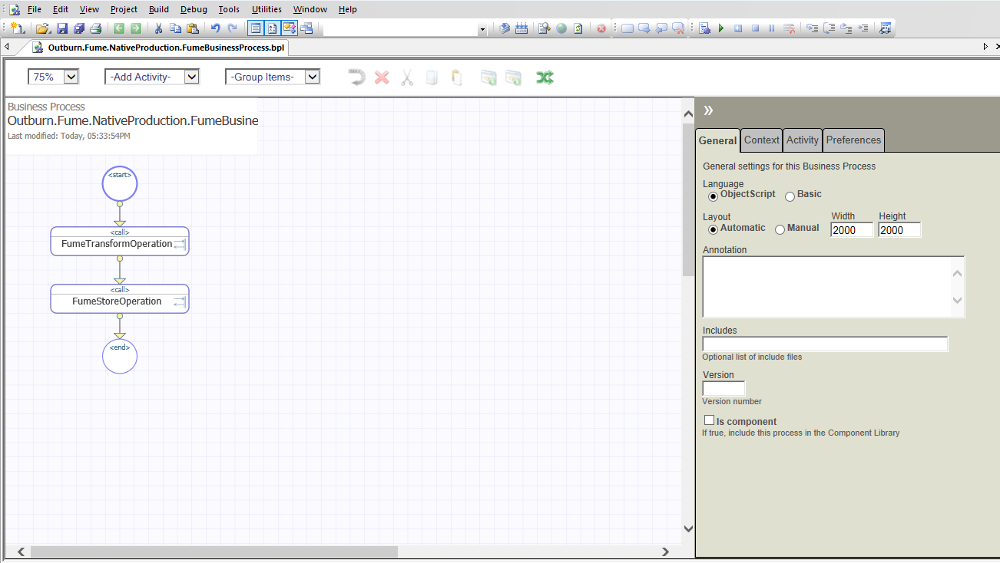
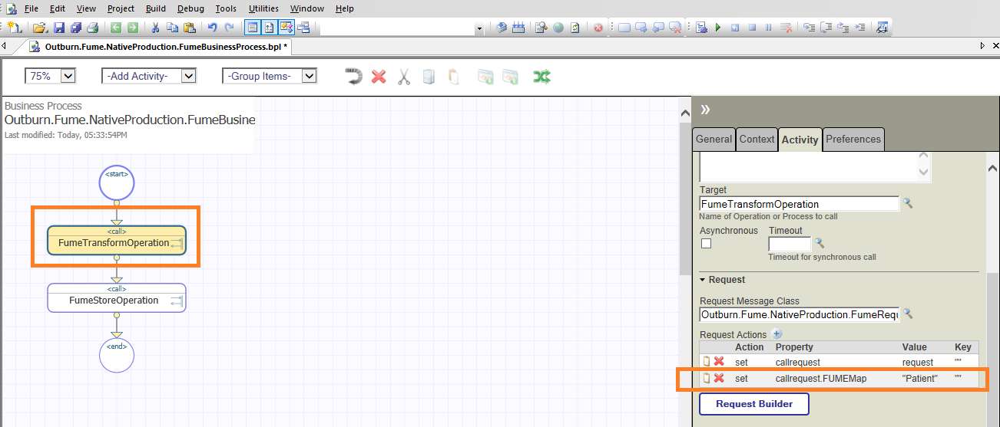

## Configuring IRIS FUME plugin

### Production component

The production contains the following properties

|Property | Description |
|---------|-------------|
| FUMEEndpoint|Specifies the URL of the FUME server. If you used the IRIS FUME plugin installer to setup the package, the value of that property should be already set.
| FUMEDesignerUrl|Specifies the URL of the FUME designer|


To change the production value, do the following:
* Open your production
* Click the `Production settings`` link
* Find and modify the property value as follows:

* Click the `Apply` button to save changes

Other important components of the production are `FumeBusinessService`, `FumeTransformOperation` and `FumeStoreOperation` which are included in the IRIS FUME Plugin distribution. 

Let us explore in detail how these components work and how they can be used to configure medical data transformations using InterSystems IRIS business process modelling tools.


### FumeBusinessService component

This component is responsible for receiving and processing incoming data in HL7 v2, CSV, and JSON formats. 

The component exposes a specific TCP port, which is specified in the settings of this component, and works as a HTTP/REST web service.
The number of instances of components of the FumeBusinessService class can be any, but it is important that each component should listen a dedicated TCP-port to avoid conflicts. Also, the TCP-port should not be blocked by a firewall.

The component handles HTTP requests which Content-Type header contains one of the following values:

* `x-application/hl7-v2+er7` - if a message in HL7 v2 format should be processed
* `application/json`, `text/json` - if a message in JSON format should be processed
* `text/csv` - if a message in CSV format should be handled

If none of these values are provided, or if the value of `text/plain` is passed in the `Content-Type` HTTP header, the component will attempt to determine the actual data type of the incoming stream on its own.

Text data is expected to be transmitted in the UTF-8 encoding by default, but you can specify a different encoding using the HTTP Content-Type header. 

**Example:**

```text
Content-Type: text/csv,charset=windows-1252  
```

**IRIS FUME Plugin** comes with a very basic business process implementation (see the `FumeBusinessProcess` component). If you have developed your custom Business processes, you can specify which one should process data streams which come from the `FumeBusinessService` component – see the Business Process settings on the FUME Settings tab.

If the component is expected to work with only certain data type, you can specify this data type in the component settings (`FUME Settings` tab, field `Content Type`).

If the client passed a stream with unknown or unsupported data type, the incoming message will be rejected and an error message will be written to the IRIS system event log.

If the message was successfully accepted, it will be written to the Production message log and then the message will be passed to the next Production component for processing. 

The `FumeHL7Request`, `FumeCSVRequest` and `FumeJSONRequest` message classes are used to transfer messages in HL7 v2, CSV and JSON formats within Production boundaries.

The component exposes the following properties:

|Property | Description |
|---------|-------------|
|Port|Specifies the TCP port which the component listens. If several FUME business services are in use, you have to assign a dedicated TCP port to each component|
|BusinessProcess|Specifies the name of a Business Process component to which the data streams should be redirected|
|Charset|Specifies the character encoding of incoming text streams. Default value is `UTF-8`. Normally this setting value should never be changed.|

### FumeTransformOperation component

This component is responsible for the direct transformation of messages of types `FumeHL7Request`, `FumeCSVRequest` and `FumeJSONRequest` into HL7 FHIR format messages (Bundle or other resource types) using the FUME transformer.

If the Production contains multiple instances of the component, all they will share the same FUME server as a medical data transformation service. The URL of FUME service endpoint is a property of Production. If you want to change the FUME service URL endpoint, please follow the instructions described in the chapter Production component.

To configure the component, register a new business operation of type `FumeTransformOperation` in Production, and then specify the following parameters:

|Property | Description |
|---------|-------------|
| SSLConfig | Specify which SSL configuration should be used to call the FUME server | 
| SSLCheckServerIdentity | This option should be disabled only in debugging mode if your FUME service instance is protected by a self-signed SSL certificate |
| FUMEMap | Specify here the code of FUME transformation rule, which should be used to transform your data into HL7 FHIR format using FUME. You can learn more about FUME transformation rules at this link - https://www.fume.health. If this field is left blank, the incoming message will be passed to the internal FUME router which will try to pick a transformation rule for the incoming message on its own. Note that the code of the FUME conversion rule for the incoming message can also be defined in the Business Process Editor, which you can develop yourself.|
|ContentType| Specifies the data format of incoming streams|

The number of components of the `FumeTransformOperation` class can be any. It is handy if you are planning to use multiple FUME transformations using different mappings.

When the process of transforming an incoming message into the HL7 FHIR format is completed, the `FumeTransformOperation` component registers a new message of type `FumeTransformResponse` in the IRIS Messages journal.

If the transformation process is completed with an error, the component writes an error message to the IRIS event log.

### FumeStoreOperation component

This component is responsible for saving a message of type `FumeStoreRequest` on a FHIR server. Messages of this type contain a nested resource in the HL7 FHIR format. 

If the saving of the FHIR resource completed successfully, the component logs a response message of type `FumeStoreResponse` in the IRIS Messages log and returns the message to the client in JSON format. 

The `FumeStoreResponse` message has a `Location` property that contains the URL of the saved FHIR resource. In some cases, this field can be empty - for example, if the resource is submitted to the FHIR server as a transactional or batch Bundle.

In case of an error, the component writes an error message to the IRIS Messages log.

Please note, that the FumeStoreOperation component uses different approaches when submitting FHIR data to the FHIR server. If the FHIR resource contains a valid identifier (Resource.id), it will be saved using HTTP PUT method, otherwise it will be submitted using HTTP POST. This will allow you to keep so-called FHIR client-assigned IDs.

In addition, the full protocol of data exchange with the FUME server will be also written to the IRIS Messages log.

To register the component, create a new Business Operation of type  `Outburn.Fume.NativeProduction.BusinessOperation.FumeStoreOperation` and give it any name (e.g. FumeStoreOperation)

The component exposes the following properties:

|Property | Description |
|---------|-------------|
| SSLConfig |  The name of an existing SSL/TLS system configuration set to use for communication with a FHIR server |
| SSLCheckServerIdentity | This option should be disabled only in debugging mode, if your FHIR server instance is protected by a self-signed SSL certificate|
| FHIRHTTPService| The identifier of the External HTTP service which should be registered to communicate with a FHIR server|

### Development and customization of Production business processes using IRIS FUME Plugin components

To develop the simplest products for converting your data in HL7 v2, CSV and JSON formats into FHIR, the three components described above are sufficient. However, you can make your own changes to the proposed architecture and replace some components with others or register additional business components. Let's look at the 
 `Business Process` component which provides coordination of data flows, as shown on the picture:
 


A component of type `FumeBusinessOperation` receives an incoming data stream, then routes data to a component of type `Business Process`. 

A component of type `Business Process`  invokes a FUME transformation using a component of type `FumeTransformOperation` which does data transformations, then invokes another component of type `FumeStoreOperation` which submits an instance of FHIR resource to the IRIS FHIR server. 

The `Business Process` editor provides the ability to fine-tune the rules of data transformation and routing. Here you can use not only FUME components but any other components and transformers which come with IRIS standard library. 

For example, in the `Business Process` editor you can specify which FUME map should be used for a specific data transformation using FUME:



If errors occur in the process of converting HL7 v2 format messages to FHIR format, they can be passed to another standard component that is responsible for receiving and storing erroneous HL7 ACK messages in the file system.