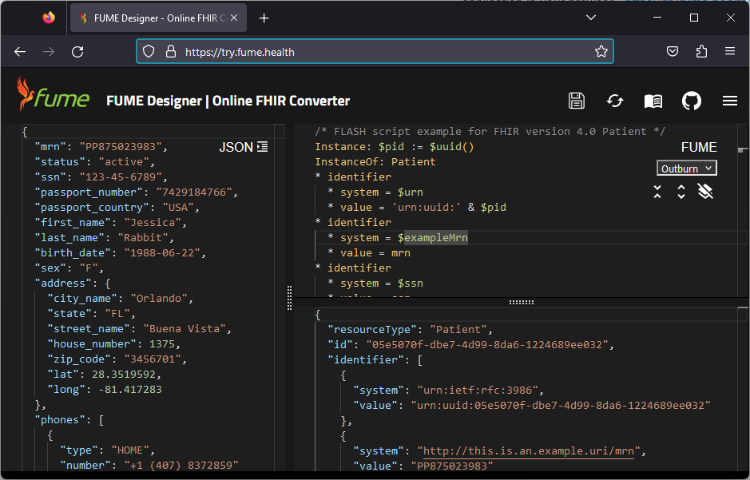

## FUME designer

FUME itself is a separate stand-alone service that provides a user with a convenient interface for developing and testing rules to convert medical data into FHIR format using FLASH expressions. Feel free to explore this service by opening the FUME application in your browser - https://try.fume.health/

