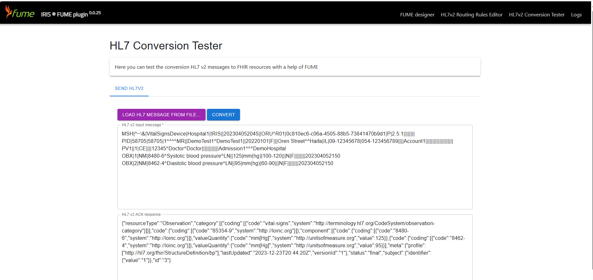

## IRIS FUME plugin HL7 v2 routing rules editor

IRIS FUME Plugin routing rules editor is a web application that runs on the InterSystems IRIS web server. The application allows users to design and test their own medical data conversion and routing rules for the FUME service on the InterSystems IRIS platform.

The application is available at the following URL:
* /csp/healthshare/{namespace}/fume/index.html

Here, the {namespace} variable should match your namespace (e.g. /csp/healthshare/clinic1/fume/index.html)

 
Before using the editor, you must develop and register a few FUME mappings using the FUME designer. 

In current release, the editor supports HL7 v2 and JSON formats.

**To design a new HL7 v2 routing rule:**

* In the `Source data` text box, type or paste source HL7 v2 message from the clipboard, or load the message from your hard drive using the Load button. 
* Click the `Convert to JSON button` to transform your HL7 message to its JSON representation
* In the `Rule name` text box, specify the name of the mapping rule
* In the `Rule priority` text box, set a numeric value which specifies the rule priority for an algorithm, which sorts rules. If a message matches several rules, the rule with the lowest priority value will be applied to transform the message
* Using the `FUME map` dropdown list, select the FUME mapping which should be used to convert data
* In the `Rule expression` text box, enter a JSONata expression that takes your JSON message as input and returns a boolean value. If the expression returns true, the message will be converted to FHIR format using the FUME map specified in the previous field. Otherwise, if the message does not match the expression, it will be rejected. 
* To test your JSONata expression, click the `Validate rule` button
* To save the rule to the IRIS database, click the `Save` button
 
**To edit an existing HL7v2 routing rule:**

* Navigate to a list of routing rules in the bottom part of the page
* Select a rule you want to edit
•	Click the `Edit` button
•	Modify rule settings (rule name, rule priority, rule expression and others)
•	Click the `Save` button to apply changes

## IRIS FUME Plugin HL7 conversion tester

This page allows a user to perform online testing of FUME HL7 V2 mappings and IRIS FUME plugin HL7 v2 routing rules.

 
In order to perform testing, follow these steps:
* Click the `HL7 Conversion tester` main menu item
* Paste the source HL7 v2 message from the clipboard into the upper text box. Alternatively, click the `Load...` button to load the message from your hard disk
* Click the `Convert` button to upload your test data to the IRIS server
* The results of the transformation will be displayed in the bottom pane of the page.
