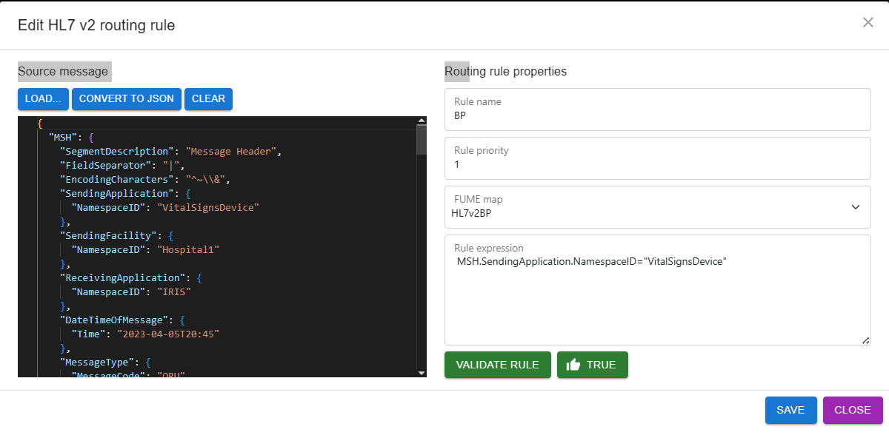

## FUME HL7v2 plugin


FUME HL7v2 plugin is a web application that runs on the InterSystems IRIS web server. The application allows users to design and test HL7v2 to FHIR conversion using FUME Plugin integrated with FUME.

The application is available at the following URL:
* /csp/healthshare/{namespace}/fume/index.html

Here, the {namespace} variable should match your namespace (example for a full path, where namespace is "clinic1":   /csp/healthshare/clinic1/fume/index.html)

The plugin is comprised of the following modules:

### FUME Designer
Link to the FUME designer (applicable for FUME Enterprise versions only).

### HL7v2 Routing Rules Editor
This module is used to configure the **routing rules** between source HL7v2 messages and the FUME conversion map.
The routing rules call the appropriate map based on the logical expressions identifying each source message. The expression syntax is based on the FLASH - FUME mapping language and provides broad flexibility for setting any logical condition. The target is to build an expression uniquely identifying the incoming message.

For example, the following expression: 

```'MSH.SendingApplication.NamespaceID='VitalSignsDevice'```

will be used to identify the following HL7v2 message (MSH segment of the message represented in JSON format) 
```
{
  "MSH": {
    "SegmentDescription": "Message Header",
    "FieldSeparator": "|",
    "EncodingCharacters": "^~\\&",
    "SendingApplication": {
      "NamespaceID": "VitalSignsDevice"
    },
    "SendingFacility": {
      "NamespaceID": "Hospital1"
    },
    "ReceivingApplication": {
      "NamespaceID": "IRIS"
    },
    "DateTimeOfMessage": {
      "Time": "2023-04-04T20:45"
    },
    "MessageType": {
      "MessageCode": "ORU",
      "TriggerEvent": "R01"
    },
    "MessageControlID": "1c9cd454-c3e6-4537-9bfa-4e7b61ddea0a",
    "ProcessingID": {
      "ProcessingID": "P"
    },
    "VersionID": {
      "VersionID": "2.5.1"
    }
  },

```

The rule set is created once for each incoming source message type and can be reused as often as needed.

Before using the editor, you must develop and register a few FUME mappings using the FUME designer. 

**To design a new HL7v2 routing rule**

Navigate to HL7v2Routing Rules Editor and click on the `Create` button




* In the `Source data` text box, type or paste the source HL7 v2 message from the clipboard or load the message from your hard drive using the Load button. 
* Click the `Convert to JSON button` to transform your HL7 message to its JSON representation
* In the `Rule name` text box, specify the name of the mapping rule
* In the `Rule priority` text box, set a numeric value that specifies the rule priority for an algorithm that sorts rules. If a message matches several rules, the rule with the lowest priority value will be applied to transform the message
* Using the `FUME mapping` dropdown list, select the FUME mapping, which should be used to convert data
* In the `Rule expression` text box, enter a FLASH expression that takes your HL7v2 message represented in JSON format as input and returns a boolean value. If the expression returns true, the message will be converted to FHIR format using the FUME mapping specified in the previous field. Otherwise, if the message does not match the expression, it will be rejected. 
* To test your FLASH expression, click the `Validate rule` button
* To save the rule to the IRIS database, click the `Save` button
 
**To edit an existing HL7v2 routing rule:**

* Navigate to a list of routing rules in the bottom part of the page
* Select a rule you want to edit
•	Click the `Edit` button
•	Modify rule settings (rule name, rule priority, rule expression, and others)
•	Click the `Save` button to apply changes

The IRIS business process should be configured as stated in the following section: 

[Applying FUME mappings to incoming data streams](/configuration.md#applying-fume-mappings-to-incoming-data-streams)

### FUME Plugin HL7 conversion tester

This page allows a user to perform online testing of FUME HL7v2 mappings and FUME plugin HL7v2 routing rules.


 
To perform testing, follow these steps:
* Click the `HL7 Conversion tester` main menu item
* Paste the source HL7v2 message from the clipboard into the upper text box. Alternatively, click the `Load...` button to load the message from your hard drive
* Click the `Convert` button to upload your test data to the IRIS server
* The transformation results will be displayed in the bottom pane of the page.

### Logs
The log tab provides a comprehensive log for HL7v2 conversion-related workflow.

