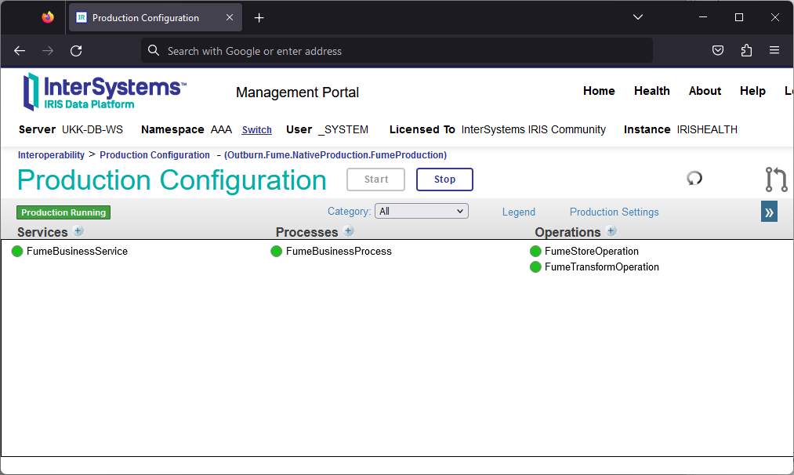

# Installing Intersystems FUME Plugin

The FUME Plugin installation is possible using ZPM (IPM) package manager.

The installer supports different platforms and workflow scenarios and can be adapted to new and existing IRIS implementations. Supported scenarios are:
 -  Existing IRIS or HealthShare Health Connect with FHIR Repository
 -  Existing IRIS or HealthShare Health Connect  without FHIR Repository when FHIR Repository is intended to be deployed as a part of the IRIS platform. 
 -  Existing IRIS or HealthShare Health Connect with 3rd party FHIR Server
 -  New IRIS or HealthShare Health Connect installation

If ZPM is not installed on your server yet, install it according to the instructions on the official [IRIS ZPM (IPM) package manager page](https://github.com/intersystems/ipm).

> Prerequisites:
1. The Outburn FUME Conversion engine is installed on the server accessible by IRIS, and the FUME Rest API is exposed.  
   **!Important note!**  Just in case the FUME instance will use as a Conformance Resource repository, the new IRIS FHIR repository, which hasn't been created yet, the     recommendation is to complete FUME configuration after 3rd step of FUME Plugin installation.   
    install FUME   
3. ZPM is installed on the target IRIS server.
4. Target namespace and database were created (if required)
   
> Installation procedure:
1.	Open InterSystems IRIS for Health terminal
2.	Authenticate yourself using your credentials
3. switch the namespace to the target one where FUME Plugin will be installed
```shell
%SYS> zn "FUME"
FUME>
```
4. Launch ZPM:
```shell
FUME> zpm
```
5. On the next step, you have to switch ZPM to use the package registry: (in the following example, Outburn private registry is appear) 

```shell
zpm:FUME> repo -r -n registry -url http://ec2-3-124-79-139.eu-central-1.compute.amazonaws.com:52773/registry/ -user **** -pass ****
```

6.	Start installation

```shell
zpm:FUME> install -dev iris-fume-plugin
```

> Installer Options
1. Confirm or change the active namespace used for a Plugin installation
2. The installer will propose the new FHIR repository creation and configuration. Please confirm if required
3. The installer will propose a default endpoint. Please confirm or change. 
4. Proivde FUME REST endpoint URL
5. Proivde FUME Designer URL
6. The installer will propose a default port for FumeBusinessService HTTP Adapter. Please confirm or change

Installation Completed! 

> Post-installation steps

1. Check if a production with the name `Outburn.FumeNativeProduction.FumeProduction` exists. You should see the following:


 
2. Check if a CSP application (Web UI) at URL `http://<iris_host>:<iris_port>/csp/healthshare/fume` is available
3.	Finally, don’t forget switch ZPM back to the community repository:

```shell
zpm:FUME> repo -r -n registry -reset-defaults
```
> Uninstallation

```shell
zpm:FUME: uninstall iris-fume-plugin
```
