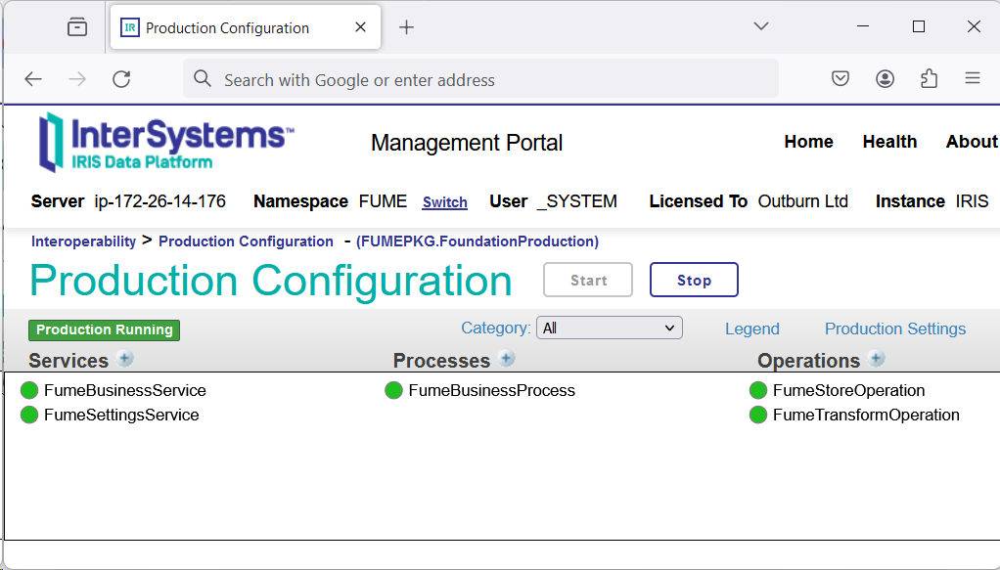

# Installing IRIS FHIR out of the BOX (FOOB)

The FOOB installer supports different platforms and workflow scenarios and can be adapted to organizational needs as follows:
 - Existing IRIS with FHIR Repository
 - Existing IRIS without FHIR Repository when FHIR Repository is intended to be deployed as a part of the IRIS platform. 
 - Existing IRIS with 3rd party FHIR Server
   
We recommend using the ZMP (IPM) package manager to install the plugin. 

If ZPM is not installed on your server yet, install it according to the instructions on the official [IRIS ZPM (IPM) package manager page](https://github.com/intersystems/ipm).

When ZPM is ready, follow these steps:
1.	Prepare a clean namespace and a database where IRIS FUME plugin should be installed to (e.g. `FUME`)

2.	Open InterSystems IRIS for Health terminal

3.	Authenticate yourself using your credentials

4.	Don’t forget to switch the namespace:
```shell
%SYS> zn "FUME"
FUME>
```

5. Launch ZPM:
```shell
FUME> zpm
```

6. On the next step, you have switch ZPM to use the Outburn package repository:

```shell
zpm:FUME> repo -r -n registry -url http://ec2-3-124-79-139.eu-central-1.compute.amazonaws.com:52773/registry/ -user **** -pass ****
```

7.	Next, execute the following command:

```shell
zpm:FUME> install -dev iris-fume-plugin
```

8.	Follow the installation instructions to complete the installation process

9.	When the installation is complete, check if it was successful:
- Check if a production with the name `Outburn.FumeNativeProduction.FumeProduction` exists. You should see the following:


 
- Check if a CSP application at URL `http://<iris_host>:<iris_port>/csp/healthshare/fume` is available
  
- By default, IRIS FUME plugin business service listens TCP port `9980`. Be sure to check if this port is opened. If not, please modify firewall settings (using your OS shell):
```shell
$ sudo ufw allow 9980
```

10.	Finally, don’t forget switch ZPM back to the community repository:

```shell
zpm:FUME> repo -r -n registry -reset-defaults
```
Package uninstallation can be done using  the following command:  
```shell
zpm:FUME: uninstall iris-fume-plugin
```
