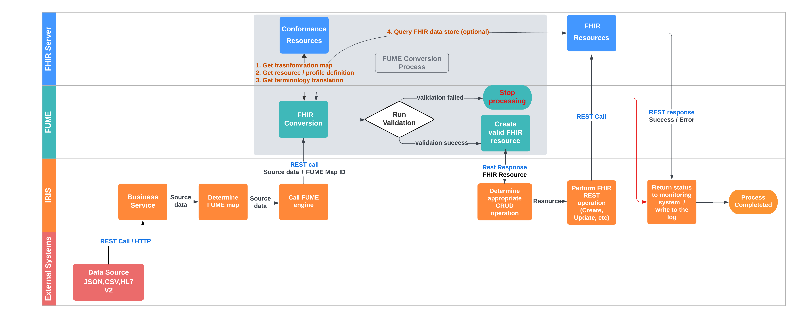

## Solution description

The **FUME plugin** is a specialized IRIS production whose primary goal is to effectively convert incoming messages in HL7 V2, CSV, and JSON formats to FHIR using a seamlessly integrated **Outburn FUME Conversion engine**. 

The following sections will explore Intersystems FUME Plugin solution components, deployment methods, and high-level dataflow definition

> FUME versions and components: 

The  **FUME** architecture is comprised of the following components: 
1. The **FUME mapping engine** is the core of the FUME FHIR® conversion and interoperability solution. The FUME engine runs as an API and uses the FHIR Server for storing and managing transformation maps as FHIR ConformanceResources resources. The FUME engine shall use the FHIR Server for managing ConformanceResources.We recommended using the IRIS FHIR Repository as a FUME backend; however, any FHIR Server can be used. The FUME Engine can be operated in Stateless mode with no FHIR Server; however, the FUME Plugin solution does not support it
2. The **FUME mapping designer** is a flexible and interactive FHIR® mapper providing the capability for creating and managing conversion maps.

The **FUME** is available in two versions: **Community and Enterprise**. The table below represents the main differences between them:

|Feature | FUME Community | FUME Enterprise |
|---------|-------------|---------------|
|**Open-Source**|V|X|
|Run transformations using RESTful API|V|V|
|Full HL7v2 terminology dictionaries|V|V|
|Use resources (Profiles, Extensions, ConceptMaps) stored on the FHIR® server|V|V|
|Flexible deployment options (cloud-based or on-prem, Docker compatible)|V|V|
|Import external packages|V|V|
|**Browse, open, edit, and save FUME mappings**|X|V|
|**Mapping Designer** (GUI)|X|V|

Visit the following page for the complete list of [Features comparison](https://outburn.co.il/discover-your-perfect-fume-match)

The FUME conversion and transformation engine Community Edition can be downloaded from the [Outburn GitHub repository](https://github.com/Outburn-IL/fume-community)

In addition, it is possible to start your jorney into the FUME world from the free, [**FUME Playground** designer Sandbox](https://try.fume.health) allows creating FUME conversion maps and moving them into the Community FUME for further usage of  **FUME mapping engine**. 
Please use the following procedure for importing FUME Conversion maps created using Playground into the FUME Community Version.

> FUME maps export-import procedure

Here is the procedure

> Dataflow

The high-level solution data-flow is represented in the diagram below:

The  IRIS production accepts a message over the exposed REST endpoint (default method)  and passes the message to the Intersystems FUME  plugin Business Service. Intersystems FUME plugin forwards a message to the FUME engine REST API along with the conversion map. The conversion map selection depends on the deployed workflow on site and supports various configurations, starting from static FUME conversion map configuration for each incoming message up to complex Routing Rules configuration supported by FUME Plugin HL7 V2 Web UI. The FUME service transforms the data and returns an FHIR resource (or a collection of separate FHIR resources packed into an FHIR Bundle, depending on the conversion map) to IRIS production. Finally, IRIS production submits FHIR data to the FHIR Server (internal IRIS FHIR repository or external FHIR Server) according to the pre-defined rules based on the FHIR resource type.

> InterSystems FUME Plugin components and features

The InterSystems FUME plugin comprised the following main features and default components:

1. **FUME Plugin ZPM package installer** supporting various platforms, implementation scenarios, and configuration options.
2. **FUME Plugin Rest Service** supporting source messages accepting in the following formats: JSON,CSV,HL7 V2.
3. **FUMEBusinessService** HTTP Adapter based Business Service supporting source messages accepting  in the following formats: JSON,CSV,HL7 V2
4. **FUMETransformOperation** Business Operation class allowing "One click" based  FUME integration and conversion map configuration from the Production           Configuration page. 
5. **FUMEStoreOperation** Business Operation class allows the interaction with the FHIR Server (internal IRIS FHIR  repository or external FHIR Server) and provides automatic REST call construction depending on the FHIR resource type/structure received from FUME. 
6. **FUMEBusinessProcess** allows entire solution workflow management according to the business requirements. The BP is capable of managing FUME conversion map calls in addition or instead of FUMETransformOperation, registration of additional components, and coordination of the data flow.
7. **FUME plugin Web-based UI**, allowing HL7 V2 to FHIR conversion management by configuring specially designed, FUME-based routing rules

