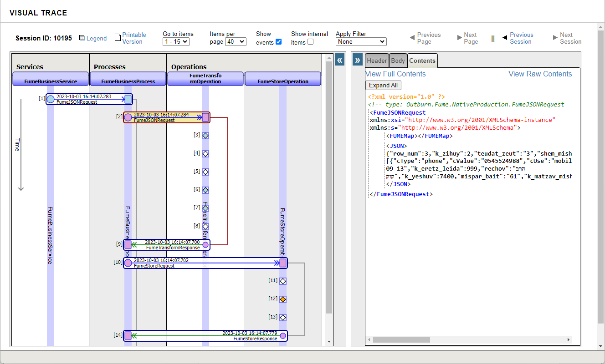
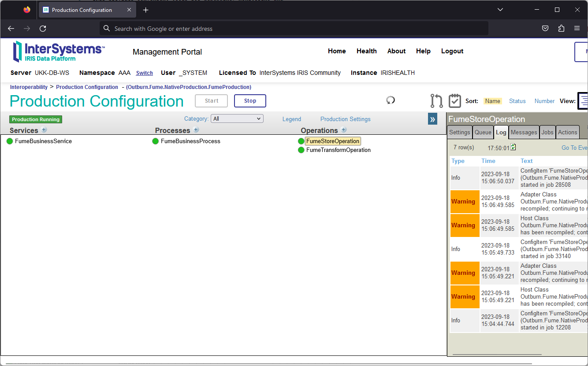
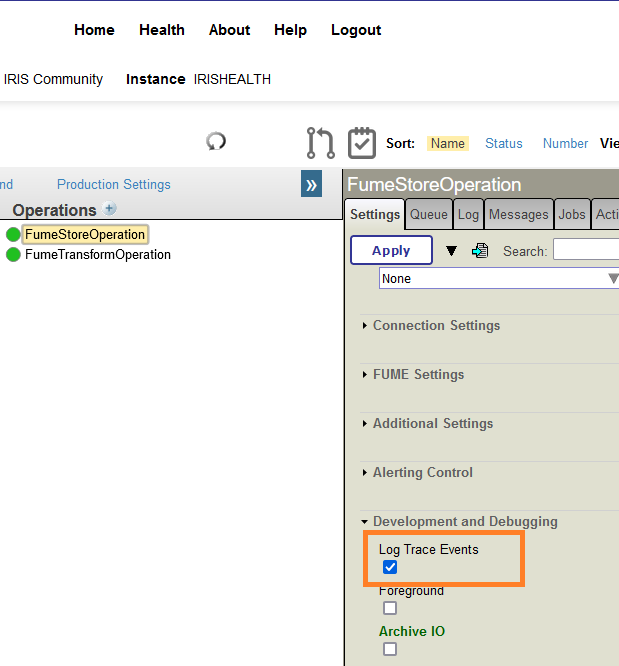

## Troubleshooting FUME Plugin

IRIS provides convenient tools for debugging, monitoring and controlling data transformation flows. 
To visualize the data transformation process, follow the steps below:
* Open the Production editor
* Select one of the FUME components (FumeBusinessService, FumeStoreOperation or FumeTransformOperation)
* Switch to the Messages tab
* Select any message
* The entire data flow will then be visualized and presented in a diagram as follows:

 
To view the Production event log, switch to the Log tab:
 

Please note that the Log Trace Events option should be set for all the Production components which actions should be logged:

